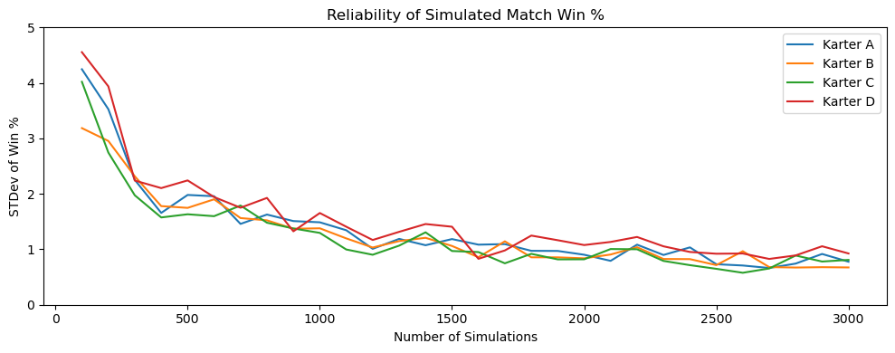
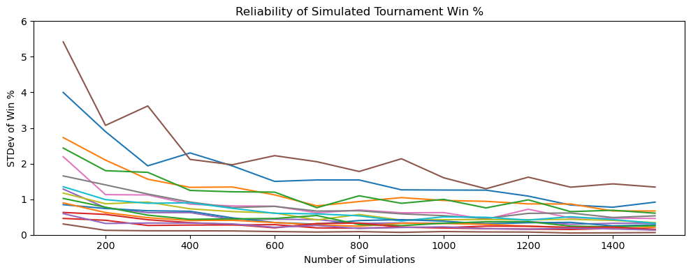
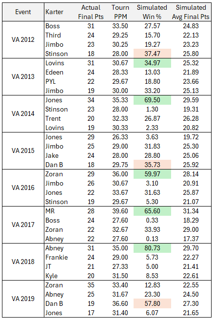
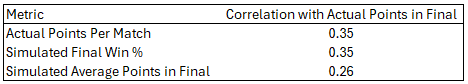

# Mario Kart Simulator v0.64 Documentation

## Introduction

Hi there! I'm DavidK5 (a.k.a. "DK"), and I created this Mario Kart Simulator app. This app allows users to simulate the results of 4-player Mario Kart 64 matches based on data from real matches. This README contains detailed documentation of the app, including descriptions of how it works and how I have developed and tested it.

If you have questions about the app that aren't answered in this README, feel free to contact me on Discord or drop me an e-mail (DavidK519@gmail.com).

## Version History

### v0.64 (released March 31, 2025)

This is the very first version of the app (wow!). This initial release includes the following features:

* A 4-player match simulator
* A 16-player tournament simulator
* A data viewer page
* A built-in dataset consisting of Virginia tournament matches from 2012-2019
* Ability for users to upload their own datasets (instructions for doing so included!)

## How the Simulator Works

So how exactly do we simulate a Mario Kart 64 match? Well, let's first look at how we simulate the results for a race on one track. Say we want to simulate the result of a race on Luigi Raceway (LR) between Karters A, B, C, and D...

1. First, for each karter, we gather their known race results from our dataset of choice (e.g., Virginia tournament data).
2. Then, we narrow those results down further to just the matches that involved the other karters in the race we are simulating. For example, for Karter A, we complie their results for any matches that involved Karter B, Karter C, or Karter D.
3. For each karter, we then choose one of their results on LR at random. This randomly selected result serves as the karter's "simulated" finish.
4. Finally, we rank the randomly selected results to determine the results of the simulated race, with ties being broken at random. For example, if the random draws were a 1st for Karter A, a 2nd for Karter B, a 2nd for Karter C, and a 3rd for Karter D, the simulated results would have Karter A coming in 1st, Karter D coming in 4th, and Karters B and C would have their tie randomly broken to determine who finishes 2nd and 3rd.

Now, after reading Step 2 above, you may ask yourself, "What if Karter A has never raced against Karters B, C, or D before? There won't be any results to draw from!" In cases where a karter has no data versus the opponents in question, we simply draw from all of their available data on the track (i.e., results from Step 1). In other words, if a karter has data versus the selected opponents, we draw results from matches against those opponents. If not, we draw results from all of their matches, regardless of opponent.

So that's how a race on one track is simulated. To simulate an entire match, we simply simulate a race on each of the 16 tracks and calculate the points earned by each karter (using the standard 1st = 3 points, 2nd = 2 points, and 3rd = 1 point), with the match winner being the karter with the most points. Again, ties in points are broken at random for the purposes of determining a single winner of the match.

The code excerpt below shows the core Python code for carrying out the match simulation...

```python
#Step 1
#Fuction that calls data for a specific karter
def karter_filter(karter):
    df_karter = df[df['Karter'] == karter]
    return df_karter

#Step 2
#Function that calls data for a karter's matches against specific opponents
def opponent_filter(karter):
    opponents = [opponent for opponent in karters if opponent != karter]
    df_opponents =
        df[(df['Karter'] == karter) & (df['Karters'].apply(lambda krts: len(set(krts).intersection(set(opponents)))) > 0)]
    return df_opponents

#Run the above functions for each karter and store the results
df_karter_dic = {k: karter_filter(k) for k in karters}
df_opponents_dic = {k: opponent_filter(k) for k in karters}

#Step 3
#Function that draws a random result for a given karter on a given track
def draw_finish(karter):
    #Create a list of results from the Step 2 function
    finishes = df_opponents_dic[karter].loc[:,track].tolist()
    #If there is not enough data from Step 2, add a random result from Step 1
    if len(finishes) < 2:
        finishes.append(np.random.choice(df_karter_dic[karter].loc[:,track]))
    #Choose a result at random
    return np.random.choice(finishes)

#Loop for repeating the match simulation the desired number of times
for sim in range(1, sims + 1):
    results = {'Sim': [sim, sim, sim, sim], 'Karter': karters}

    #Loop for simulating each of the 16 tracks
    for track in tracks:
        #Draw a random finish (Step 3 function) for each karter
        track_finishes = [draw_finish(karter) for karter in karters]

        #Step 4
        #Check if there are ties and, if so, rank the finishes and use RNG to break the ties
        if len(set(track_finishes)) < 4:
            track_finishes = np.lexsort((np.random.random(4), track_finishes)).argsort().tolist()
        #Rank the finishes if there are no ties
        else:
            track_finishes = np.argsort(track_finishes).argsort().tolist()
```
You may notice in the code above that we actually perform a draw from a karter's overall data not only when there is no data versus the selected opponents, but specifically when there are fewer than two match results versus the selected opponents (noted as "not enough data"). This is an intentional adjustment to the basic process described above that is discussed in more detail in the Simulator Development section.

## Simulator Performance

Ok, so it's neat that we can simulate Mario Kart matches with a relatively simple computer program, but what is the value in doing this? If we want to assess a karter's performance in matches, we can simply analyze the data itself and determine things like how many matches they have won, their points per match average, etc.

But what if we want to estimate how often a karter will win a specific matchup? Well, if that specific matchup has actually happened in the past, perhaps we just go by the karter's actual win rate in those matches. But what if a specific match has not happened before, or it has happened only once or twice? Then we might need a different technique for estimaing win rates...

The intended utility of the simulator is for estimating win rates for specific matchups, even matchups that have never actually happened yet! As long as each karter has some match data, we can simulate a 4-player matchup even if those karters have not faced each other before. The estimated win rate may be derived by simulating the matchup a certain number of times (say, 100 times) and calculating the percentage of simulated matches each karter wins.

In the sections that follow, I discuss the current simulator's performance in terms of its consistency of win rate estimation (i.e., reliability) and its predictive validity. All of these analyses were done using Virginia tournament data from 2012 to 2019.

### Consistency of Results (Reliability)

When estimating win probability through simulation, the consistency of the results will depend on the number of times the match is simulated. This can be likened to tossing a fair coin multiple times and seeing how often it lands heads. If you do more tosses, your results will tend to be closer to 50% heads. The same principle applies to our simulations; the more times the match is simulated, the more consistent the results will be.

So the question then becomes, "how many simulations do we need to get reliable results?" Luckily, we don't have to guess how many simulations are enough, because we can run tests to figure it out!

To test this, I would run sets of simulations for a specific matchup and vary the number of simulations performed for each set. This would give me, for instance, a sample of results based on 100 simulations, another sample based on 200 simulations, and so on. For each of these samples, I calculated the variability in win percentage for each karter. I then examined how this variability in win % changes as the number of simulations increases. The expectation is that variability in win % will go down as the number of simulations goes up.

The graph below displays the results of one of these tests. For this example, I purposefully selected a relatively high parity matchup, with the most favored karter's win % being about 33% and the least favored karter's being about 20%. This should give us greater variability in win % for each karter and give us an idea of how many simulations we need when the karters are fairly evenly matched. I have done this type of testing for different matchups (e.g., with less parity), and the results tend to be similar in terms of when variability levels off.



We can see that the standard deviation (STDev) in win % decreases sharply until we get to around 400-500 simulations, at which point the decrease becomes much more gradual. Once we go beyond 1200 simulations or so, the variability in win % seems to level off even more. By the 2500 mark, variability seems to almost completely flatten to a standard deviation of 1% or or less. With a standard deviation of 1%, we would expect about 68% of our results to be within +/- 1% of the mean and 95% of our results to be within +/- 2% of the mean. In other words, once we get to 2500 simulations or more, fluctuations in win % will mostly be within 2% and will rarely exceed 4%.

What about when we simulate a tournament? The graph below shows the results of the test on simulated tournament win %.



This looks a bit messier because we're plotting results for 16 karters instead of 4. But, we can see the trend in win % variability is similar. We get sharp declines for the higher variance karters until about 400 simulations. For most karters, the variability levels off completely after 1200 simulations.

#### What can we take away from these results?

* For match and tournament simulation, increasing the number of simulations gives considerably better results consistency until about the 500 mark, after which point the benefits rapidly diminish. Benefits to consistency of match simulation seem to diminish almost completely by about 2500 simulations.

* Given these results, I set the default number of simulations in the current version of the app to 500, as this will yield reasonably consistent results with a quick run time. For users who want more highly consistent results and don't mind longer run times, 2500 simulations should be sufficient.

* These results are based on 8 years of Virginia tournament data, but I do hypothesize that larger datasets may require more simulations. With that in mind, I have set the maximum number of simulations to 10000, which should more than accommodate larger datasets.

### Predictive Validity

To assess the simulator's predictive validity, I simulated the Virginia tournament final match for each year from 2012 to 2019 using the data from all of the tournament matches from that same year (leaving out the actual results from the final match, of course). To ensure high consistency, each match was simulated 3000 times.

The results are displayed below with the simulator favorite to win (i.e., highest win %) highlighted in green if it matched the actual winner and red if it didn't...



We can see that in 5 out of the 8 final matches, the karter who actually won was also most favored to win by the simulator. In other words, the simulator "correctly" predicted the winner slightly more than half the time. This predictive performace is kinda... underwhelming! So let's look at the cases where the simulator stumbled...

* **2012:** Boss won this final but was only second-most favored by the simulator to win behind Stinson's 37%. This is a very interesting result, because Boss was consistently strong in this tournament, having the highest PPM of the finalists, while Stinson actually had the lowest PPM. So why did the simulator favor Stinson? Well, in his only two matches against other finalsts, Stinson's PPM was 32 (still lower than Boss), BUT he averaged 7 1st place finishes in those matches which was higher than Boss. So in this case, the simulator is pulling more 1sts for Stinson than for Boss in the simulated final, likely leading to more wins for Stinson.

* **2015:** Yikes! What happened here? Jones won this final, but the simulator did not like him at all, estimating him to win only 3.6% of the time! If we look at the results from the 2015 tournament leading up to the final, this simulated result is not as puzzling as it first appears. We see that Jones had underwhelming performances in the early rounds and eeked his way into the semifinals as the bottom seed. This is reflected in his PPM being the lowest of the finalists in 2015. These weaker results in the early rounds seem to have a big impact on the simulation, especially when the sample size is so small.

* **2019:** Here our actual tournament winner, Zoran, only won 12.8% of the simulations... well behind Dan and Abney. If we look at the data, Zoran only faced other finalists in one match prior to the final, which was the semifinal. In this match, Zoran got 27 points, BUT only 3 1st place finishes, which was way fewer than he was getting in his other matches. So, more than half the time, the simulator will be drawing Zoran's results from this semifinal match with relatively few 1sts. Meanwhile, Dan and Abney had more 1st place finishes in their matches against other finalists. As we observed with the 2012 simulation results, the karters with more 1st place finishes in their data seem to get more simulated wins.

Now, how does the predictive value of the simulator results stack up to a more basic metric like points per match (PPM)? Well, if we just look at the finalists' actual PPM in matches prior to the final in each year, the karter with the highest PPM won in the final 6 out of 8 times. The discrepant cases were the 2015 and 2019 finals which the simulator also "incorrectly" predicted. So, in terms of predicting the winner, PPM does a slightly better job here.

To further compare the simulated results to actual PPM, I computed a few simple correlation coefficients between our predictive metrics and actual points earned in the final. The correlation coefficients are displayed below. We see that actual PPM and simulated win % are both modestly correlated with actual points in the final. Simulated average points in the final has a noticeably weaker association with actual points in the final.



#### What can we take away from these results?

* Disappointingly, simulated win % does not outperform PPM in terms of predictive value in this analysis and even does a worse job for some cases. However, keep in mind that the sample sizes for the present analysis are very small... perhaps too small to allow for a truly robust comparison. That being said, even if simulation results are really not a better predictor of real match performance than PPM, simulated win % can still serve as a qualitatively different metric than PPM. Remember that the point of the simulator is to estimate win probability, which may not be simple to do using simple aggregated match statistics.

* The simulator struggles to reflect "realistic" parity in some cases. We can see that more than a few karters have very dismal simulated win %, even those who "realistically" had reasonable chances of winning the final match in real life. I have found this to be a weakness of the simulator not just in the tests reported here, but in other testing as well. However, I do hypothesize that parity will be less of a problem with larger datasets.

## Simulator Development

One of my goals in developing the simulator was to use a method that is entirely data-driven and relies on few very (if any) statistical assumptions. Another goal was to devise a method that takes opponents into account and does not just rely on aggregated match statistics.

### My original idea...

The process described in the How The Simulator Works section was not how I initially envisioned it would work. My original idea was to randomly draw a result versus each opponent and then average those draws to determine the simulated finish. The following is a detailed description of my original idea...

1. To simulate results for a race between Karters A, B, C, and D, first for each karter, a known race result versus each opponent is drawn at random. For example, three known race results on the track in question for Karter A are drawn at random: one from a race versus Karter B, one from a race versus Karter C, and one from a race versus Karter D.
2. If there are no known results versus an opponent (e.g., Karter A has never raced against Karter B), a random known result for the karter, regardless of opponent, is drawn instead.
3. The three randomly drawn results are then averaged into a single value. For example, if the random draws for Karter A were 1st, 1st, and 4th, their average finish would be 2. This process is repeated until an average finish is calculated for each karter.
4. The average finishes are then ranked to determine the results of the simulated race, with ties being broken at random. For example, if the average finishes for karters, A, B, C, and D were 2, 1.33, 3, and 2.33, the simulated result would be: Karter A = 2nd, Karter B = 1st, Karter C = 4th, and Karter D = 3rd.

I developed the core code of the simulator based on this idea and conducted quite a bit of testing on it (simulating a lot of random matchups, among other things, on the Virginia data). After playing with the simulator a lot, I was dissatisfied with a few things...

First, I wasn't happy with how long it was taking the simulations to run. I am by no means an expert programmer, but I did spend a lot of time evaluating the simulator code for inefficiencies that could be corrected without fundamentally changing what the simulator was doing. I even pasted my code into ChatGPT a few times and asked it to make it run faster.

I was also concerned about the lack of parity in some of the results. There were a lot of cases where dominant players were basically never losing, and the results just didn't look realistic. Granted, this is still a bit of a problem in the current version of the simulator (see the Predictive Validity section), but it was even more pronounced with this initial averaging method.

So I decided to rethink the simulation method in hopes of fixing these problems. I considered different aggregation methods (e.g., using the median instead of averaging) to create more parity, but this didn't address the issue with computation time. Then I considered the slowness of looping through all three opponents individually to pull results and thought about doing something more simple.

### The current method...

This brought me to the core idea of the current version of the simulator, which is to simply draw one result from matches involving any of the opponents. Tests of this method produced "better looking" results in terms of parity while also cutting the processing time in half!

I was mostly satisfied with this method... until I encountered a few odd results in testing that almost made me go back to the drawing board again. Recall that in my original idea, if a karter has no data versus an opponent, a random result from any of their matches (regardless of opponent) is drawn instead. Similarly, in this new "single draw" method, I initially dealt with this problem by drawing a random result from any match if the karter has no data versus the opponents in question.

However, we can encounter some very weird results in cases where a karter has data for exactly one match versus the opponents in question. In this scenario, the karter's results are determined entirely based on data from one match, and there will be zero variability in the karter's draws from one simulated match to another. This will also be the case for any karter who has data for only one match period. This is why I recommend in the instructions that every karter have at least two matches of data!

Anyway, to fix this problem I modified the condition for pulling from the karter's overall data. Instead of doing this when there are zero matches versus the opponents, this will happen if there are fewer than two matches. This adjustment ensures that there will always be variability in the karter's draws across simulated matches (except when the karter only has data for one match period, but that problem is best fixed by getting more data :P).

## FAQ

### Why did you make this thing? You don't even play Mario Kart!

True! But that doesn't mean I can't take an interest in it! I've been fortunate enough to attend a few Virginia meets and get to know many people in the Kart community, so there is a bit of a connection there.

As for my motivation for making the app? Well, I'm trying to learn Python, and this began as just an exercise to help me do that. I didn't originally intend to make an app that I would actually share publicly. But as I learned more, I saw this as an opportunity to make something cool, and so here we are!

### These results are BS! It says So 'n so Karter wins 100% (or 0%) of the time! What's going on here?

The simulation results are driven entirely by the data you use. Generally, the more data you have, the "better" the results should be. If you get a weird simulation result, I suggest going into the Data Viewer in the app and looking at the karter's stats for the matchup in question! Also, I am aware of issues with parity (karters winning/losing more often than you would expect) and discuss this in the Predictive Validity section of this README.

### Why can't I set the number of simulations higher than 10000?

The limit is currently set at 10000 to a) keep simulation run times reasonable and b) because this should be more than high enough for most use cases. See the Consistency of Results section of this README for more details on this topic.

### I have an idea for a new feature! Will you add it?

I welcome feedback and ideas from users to make this app better. If there is enough demand from the community, and I have the time to implement new features to the app, I will do so. However, keep in mind that this app is open-source, so if you really want to add features you may copy the source code and modify it for whatever purposes you want!

### Your code is terrible! Will you fix it?

I welcome constructive feedback from users, and as stated above, I will implement features and improvements to the app if there is enough demand and I have the time to work on it. And again, this app is open-source, so you are free to take the code and improve it yourself if you want!
